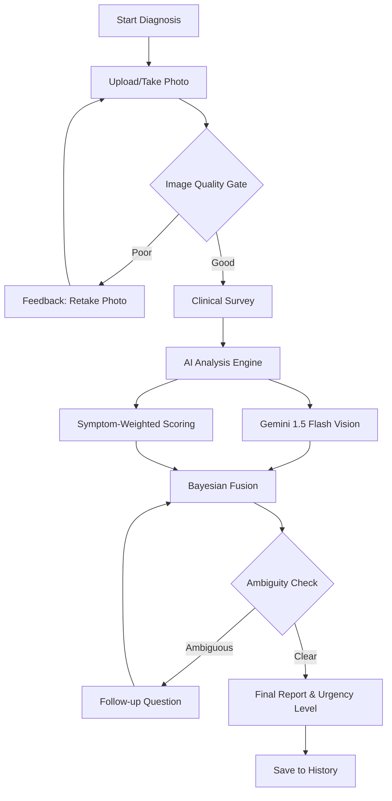
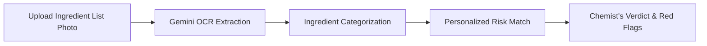
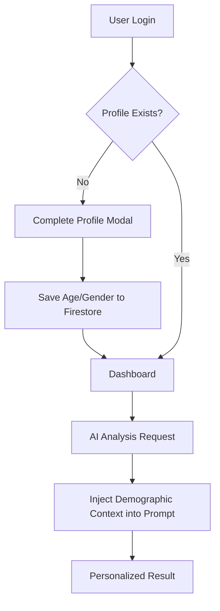

# SkinSense: AI-Assisted Skin Health Support

SkinSense is a sophisticated web application designed to empower users with accessible, AI-driven skin health guidance. By combining computer vision, clinical surveys, and personalized demographic data, SkinSense provides preliminary assessments of common skin conditions and analyzes skincare product ingredients.

## 🌟 Key Features

- **AI Skin Diagnosis**: Multi-layered analysis using Gemini 1.5 Flash to identify potential skin conditions from photos.
- **Personalized Accuracy**: Integrates user age and gender into AI prompts to weight condition likelihoods (e.g., hormonal acne vs. age-related dermatoses).
- **Product Ingredient Analyzer**: OCR-based analysis of skincare products to flag irritants, allergens, and comedogenic ingredients.
- **SkinGuide AI Assistant**: An empathetic chat interface for follow-up questions regarding scan results.
- **Secure Scan History**: Persistent storage of past assessments via Firebase Firestore.
- **Dermatologist Locator**: Quick access to professional medical help nearby.

## 🛠️ Tech Stack

- **Frontend**: React 18, TypeScript, Vite
- **Styling**: Tailwind CSS, Lucide Icons
- **Animations**: Framer Motion
- **Backend/Database**: Firebase (Auth & Firestore)
- **AI Engine**: Google Gemini 1.5 Flash (via `@google/genai`)

---

## 📊 System Workflows

### 1. Diagnostic Analysis Flow
This flowchart describes the process from image upload to final diagnostic support.



### 2. Product Ingredient Analysis
How the application analyzes skincare products for safety.



### 3. User Onboarding & Personalization
Ensuring every analysis is tailored to the individual.



---

## 🚀 Getting Started

### Prerequisites
- Node.js (v18+)
- Firebase Project
- Google Gemini API Key

### Installation

1. **Clone the repository**
2. **Install dependencies**
   ```bash
   npm install
   ```
3. **Configure Environment Variables**
   Create a `.env` file in the root directory:
   ```env
   GEMINI_API_KEY=your_gemini_api_key
   ```
4. **Firebase Configuration**
   Ensure `firebase-applet-config.json` is present in the root with your Firebase project credentials.

5. **Run Development Server**
   ```bash
   npm run dev
   ```

## ⚠️ Medical Disclaimer
SkinSense is an educational support tool and **not** a medical diagnostic device. The information provided should not be used as a substitute for professional medical advice, diagnosis, or treatment. Always seek the advice of a physician or other qualified health provider with any questions you may have regarding a medical condition.
